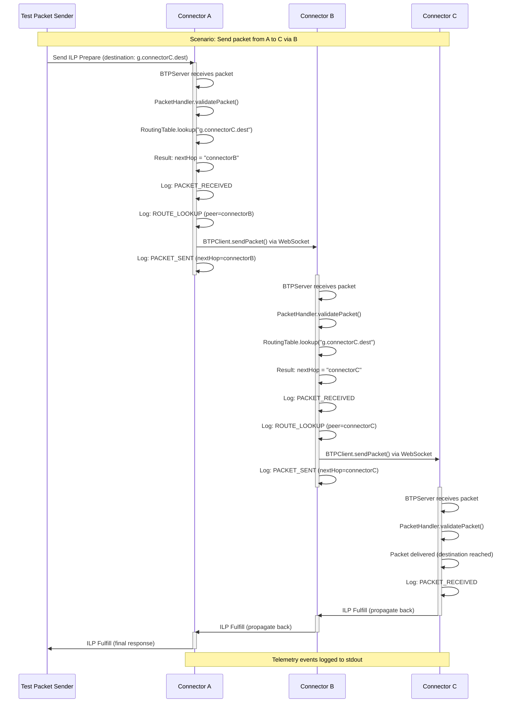
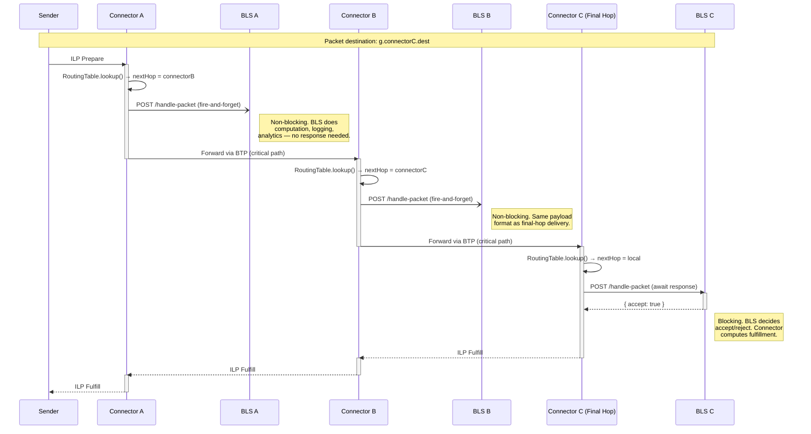
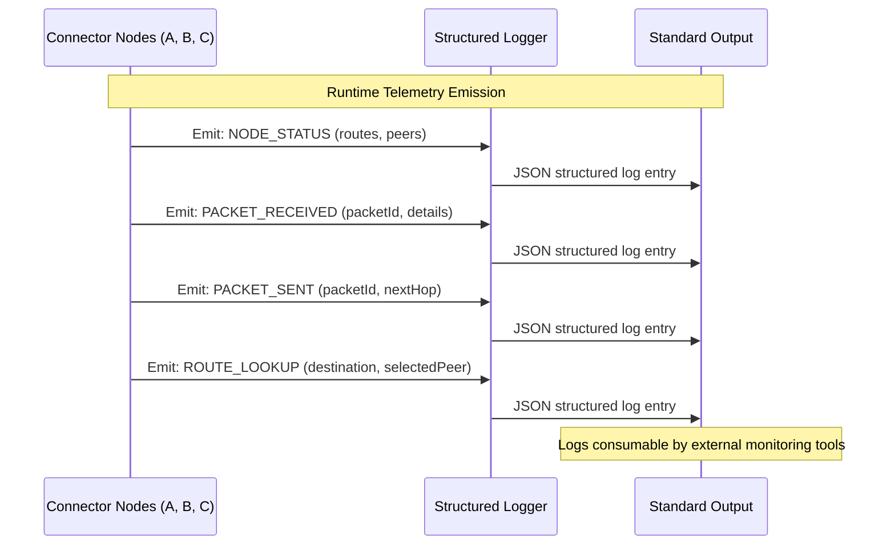
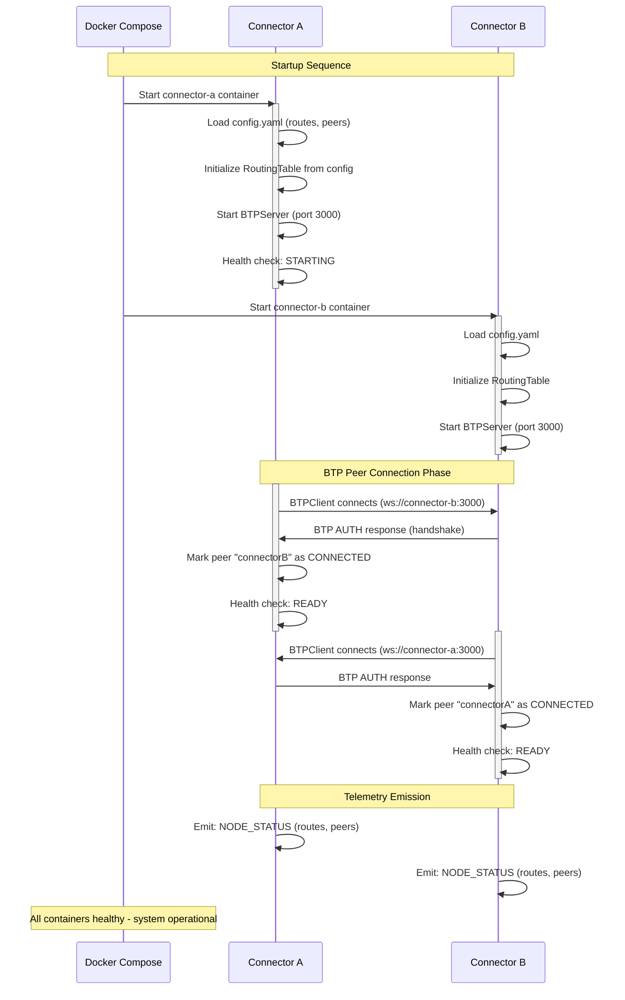
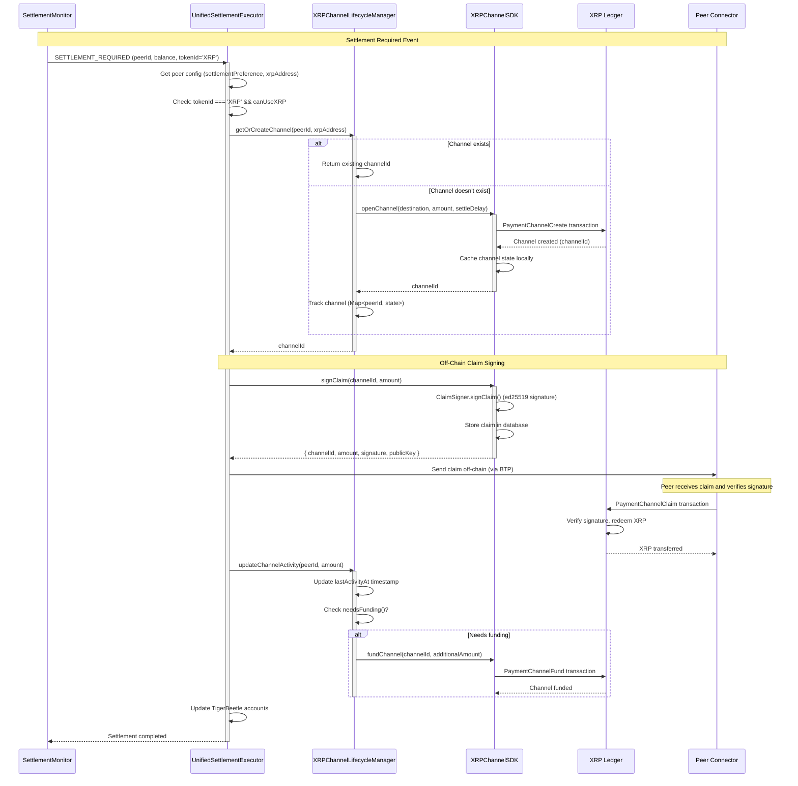
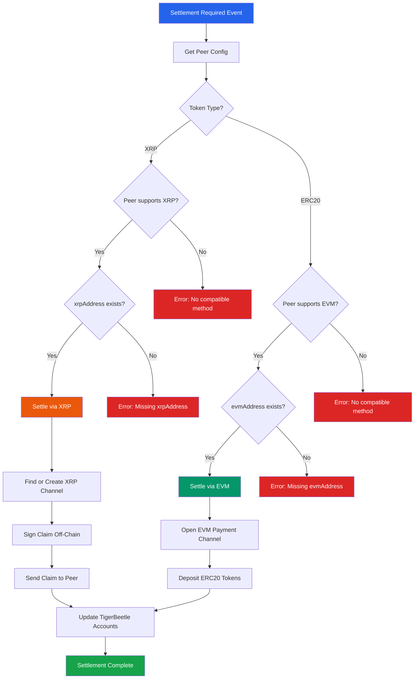

# Core Workflows

## Packet Forwarding Workflow (Multi-Hop)

The following sequence diagram illustrates the core ILP packet forwarding flow through multiple connector hops with telemetry emission:



## Per-Hop BLS Notification Pipeline

Every connector in the path can notify its local Business Logic Server (BLS) when a packet transits through. Intermediate hops fire-and-forget the notification (non-blocking), while the final hop awaits a fulfill/reject decision from its BLS.



### Key Behaviors

- **Intermediate hops**: `localDeliveryClient.deliver()` is called with `.catch(noop)` — no `await`, no impact on the critical forwarding path
- **Final hop**: `localDeliveryClient.deliver()` is awaited — the BLS response determines whether to return ILP FULFILL or ILP REJECT
- **Same payload**: Every BLS receives the same `PaymentRequest` format (`paymentId`, `destination`, `amount`, `expiresAt`, `data`) regardless of hop position
- **No packet modification**: The ILP packet is forwarded unchanged to the next hop — the BLS notification is a pure side-effect
- **Failure isolation**: If a fire-and-forget POST fails at an intermediate hop, the packet forwarding is unaffected

## Telemetry and Observability Workflow

**Note:** Dashboard visualization deferred - see DASHBOARD-DEFERRED.md in root



## Connector Startup and BTP Connection Establishment



## XRP Settlement Workflow (Dual-Settlement)

The following sequence diagram illustrates the XRP settlement flow with dual-settlement support:



## XRP Channel Lifecycle State Machine

```
┌────────────────────────────────────────────────────────────┐
│              XRP Channel Lifecycle                         │
└────────────────────────────────────────────────────────────┘

  getOrCreateChannel()
         │
         ▼
    ┌────────┐
    │  OPEN  │ ◄──────────────────┐
    └───┬────┘                     │
        │                          │
        ├─► updateChannelActivity()│
        │                          │
        ├─► needsFunding() ?       │
        │   └─► fundChannel() ─────┘
        │
        ├─► Idle > threshold ?
        │   └─► closeChannel('idle')
        │
        ├─► Approaching CancelAfter ?
        │   └─► closeChannel('expiration')
        │
        ▼
   ┌─────────┐
   │ CLOSING │ ──► Settlement delay period (e.g., 24 hours)
   └─────────┘
        │
        ▼
   ┌────────┐
   │ CLOSED │ ──► Channel removed from ledger
   └────────┘

Lifecycle Events (Periodic Checks - Every 1 Hour):
- Idle Detection: Close channels idle > idleChannelThreshold
- Expiration Handling: Close channels within 1h of CancelAfter
- Funding Checks: Fund when balance < minBalanceThreshold
```

## Dual-Settlement Routing Workflow


